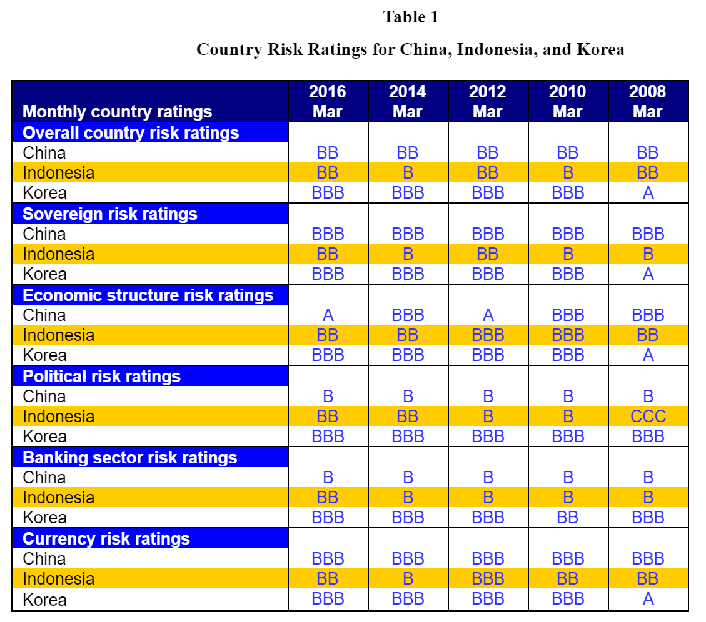

```{r setup, echo=FALSE, message=FALSE}
library(reshape)
library(ggplot2)
library(plyr)
library(reshape)
library(scales)
library(ggthemes)

x <- read.csv (
    "Team-1-Data.csv", 
    na.strings=c("NA","NaN", " ", "..") 
    )

plotList <- read.csv("Team-1-Definition-and-Source.csv")

names(x)[5:40] <- c(1980:2015)
data <- subset(x, select=-c(Country.Name, Series.Name))
names(data)[1] <- "Country"
mdata <- melt(data, id=c("Series.Code","Country"), variable.name="Year", value.name="Value")
mdata$variable <- as.Date(mdata$variable, format="%Y")
```

# Team Membership

* Madeline Augustin
* Zifei Dai
* Dennis Huffman
* Brad Lindaas
* Eric Midden
* Meredith Wieck

# Assignment Details

## Purpose

This assignment helped us become familiar with international data and information sources and make observations about economic development and investment conditions in different countries. Specifically, the countries compared here are China, Indonesia, and Korea.

## Process

Go to the World Bank's World dataBank website and select the “World Development Indicators and Global Development Finance” database. Extract the following data series for the countries in the sample for the years 1980-present and save them in an Excel file. For each variable, make a graph that compares the trends in the three countries since 1980. Note that some observations in dataset are missing. Those observations need to be blank in the worksheet; otherwise they will show up as zeros in graphs.

Please paste the graphs that you make on pages labeled accordingly below (2 points each):

1. GDP per capita, PPP (constant 2011 international $)  (For graph, please use log form of this variable.)
1. Trade (% of GDP) (This is the sum of exports and imports as share of GDP.)
1. External balance on goods and services (% of GDP) (or trade deficit)
1. (Budget) Cash Surplus/Deficit (% of GDP)
1. Gross capital formation (% of GDP) (Same as gross investment.)
1. Foreign direct investment, net inflows (% of GDP)
1. GDP per unit of energy use (constant 2011 PPP $ per kg of oil equivalent)
1. Manufacturing, value added (% of GDP)

\pagebreak

# Plot 1

```{r PLot1, echo=FALSE, message=FALSE, error=FALSE, warning=FALSE}
### Plot 1
p <- ggplot (
    data = mdata[ which(mdata$Series.Code==plotList$Code[1]), ] 
    ,aes(x = variable, y = value, color = Country, group = Country)
)
p + geom_line(aes(), size=2) +
   theme_bw() +
#    theme_economist() + scale_colour_economist() +
    ggtitle(plotList$Indicator.Name[1]) +
    theme(text = element_text(size=10)) +
    scale_y_log10(name="", labels=dollar) + # This creates a log scale for Plot 1 only
    annotation_logticks(side = "l")  +
    scale_x_date(name = "", date_breaks = "4 years", date_labels = "%Y")

```

## Description

`r plotList$Long.definition[1]`

## Source

`r plotList$Source[1]`

\pagebreak

# Plot 2

```{r PLot2, echo=FALSE, message=FALSE, error=FALSE, warning=FALSE}
### Plot 2
p <- ggplot (
    data = mdata[ which(mdata$Series.Code==plotList$Code[2]), ] 
    ,aes(x = variable, y = value/100, color = Country, group = Country)
)
p + geom_line(aes(), size=2) +
   theme_bw() +
#    theme_economist() + scale_colour_economist() +
    ggtitle(plotList$Indicator.Name[2]) +
    scale_y_continuous(name="",labels=percent) + 
    theme(text = element_text(size=10)) +
    scale_x_date(name = "", date_breaks = "4 years", date_labels = "%Y") 
```

## Description

`r plotList$Long.definition[2]`

## Source

`r plotList$Source[2]`

\pagebreak

# Plot 3

```{r PLot3, echo=FALSE, message=FALSE, error=FALSE, warning=FALSE}
### Plot 3
p <- ggplot (
    data = mdata[ which(mdata$Series.Code==plotList$Code[3]), ] 
    ,aes(x = variable, y = value/100, color = Country, group = Country)
)
p + geom_line(aes(), size=2) +
   theme_bw() +
#    theme_economist() + scale_colour_economist() +
    ggtitle(plotList$Indicator.Name[3]) +
    scale_y_continuous(name="",labels=percent) + 
    theme(text = element_text(size=10)) +
    scale_x_date(name = "", date_breaks = "4 years", date_labels = "%Y") 
```

## Description

`r plotList$Long.definition[3]`

## Source

`r plotList$Source[3]`

\pagebreak

# Plot 4

```{r PLot4, echo=FALSE, message=FALSE, error=FALSE, warning=FALSE}
### Plot 4
p <- ggplot (
    data = mdata[ which(mdata$Series.Code==plotList$Code[4]), ] 
    ,aes(x = variable, y = value/100, color = Country, group = Country)
)
p + geom_line(aes(), size=2) +
   theme_bw() +
#    theme_economist() + scale_colour_economist() +
    ggtitle(plotList$Indicator.Name[4]) +
    scale_y_continuous(name="",labels=percent) + 
    theme(text = element_text(size=10)) +
    scale_x_date(name = "", date_breaks = "4 years", date_labels = "%Y") 
```

## Description

`r plotList$Long.definition[4]`

## Source

`r plotList$Source[4]`

\pagebreak

# Plot 5

```{r PLot5, echo=FALSE, message=FALSE, error=FALSE, warning=FALSE}
### Plot 5
p <- ggplot (
    data = mdata[ which(mdata$Series.Code==plotList$Code[5]), ] 
    ,aes(x = variable, y = value/100, color = Country, group = Country)
)
p + geom_line(aes(), size=2) +
   theme_bw() +
#    theme_economist() + scale_colour_economist() +
    ggtitle(plotList$Indicator.Name[5]) +
    scale_y_continuous(name="",labels=percent) + 
    theme(text = element_text(size=10)) +
    scale_x_date(name = "", date_breaks = "4 years", date_labels = "%Y") 
```

## Description

`r plotList$Long.definition[5]`

## Source

`r plotList$Source[5]`

\pagebreak

# Plot 6

```{r PLot6, echo=FALSE, message=FALSE, error=FALSE, warning=FALSE}
### Plot 6
p <- ggplot (
    data = mdata[ which(mdata$Series.Code==plotList$Code[6]), ] 
    ,aes(x = variable, y = value/100, color = Country, group = Country)
)
p + geom_line(aes(), size=2) +
   theme_bw() +
#    theme_economist() + scale_colour_economist() +
    ggtitle(plotList$Indicator.Name[6]) +
    scale_y_continuous(name="",labels=percent) + 
    theme(text = element_text(size=10)) +
    scale_x_date(name = "", date_breaks = "4 years", date_labels = "%Y") 
```

## Description

`r plotList$Long.definition[6]`

## Source

`r plotList$Source[6]`

\pagebreak

# Plot 7

```{r PLot7, echo=FALSE, message=FALSE, error=FALSE, warning=FALSE}
### Plot 7
p <- ggplot (
    data = mdata[ which(mdata$Series.Code==plotList$Code[7]), ] 
    ,aes(x = variable, y = value, color = Country, group = Country)
)
p + geom_line(aes(), size=2) +
   theme_bw() +
#    theme_economist() + scale_colour_economist() +
    ggtitle(plotList$Indicator.Name[7]) +
    theme(text = element_text(size=10)) +
    scale_y_continuous(name="", labels=dollar) + # This creates a log scale for Plot 1 only
    scale_x_date(name = "", date_breaks = "4 years", date_labels = "%Y") 
```

## Description

`r plotList$Long.definition[7]`

## Source

`r plotList$Source[7]`

\pagebreak

# Plot 8

```{r PLot8, echo=FALSE, message=FALSE, error=FALSE, warning=FALSE}
### Plot 8
p <- ggplot (
    data = mdata[ which(mdata$Series.Code==plotList$Code[8]), ] 
    ,aes(x = variable, y = value/100, color = Country, group = Country)
)
p + geom_line(aes(), size=2) +
   theme_bw() +
#    theme_economist() + scale_colour_economist() +
    ggtitle(plotList$Indicator.Name[8]) +
    scale_y_continuous(name="",labels=percent) + 
    theme(text = element_text(size=10)) +
    scale_x_date(name = "", date_breaks = "4 years", date_labels = "%Y") 
```

## Description

`r plotList$Long.definition[8]`

## Source

`r plotList$Source[8]`

\pagebreak

###Question

2. Looking at the data and the graphs that you have prepared for the above question, what seem to be the consequences of the global financial crisis in 2008 for the GDP per capita, total trade, trade balance, budget deficit, capital formation, and manufacturing production in the three countries? Did they respond the same way or differently to the crisis? (9 points)

###Answer

These three countries seem to have had different responses to the global financial crisis of 2008.

* Consider per capita GDP. Neither Indonesia nor China see a pause to their GDP growth trajectory, however South Korea did. In fact, South Korea appears to have no GDP growth immediately after the crisis begins. (This is more pronounced if you view the graph without a log scale.)
* All three of these countries relied heavily on trade in their economies prior to the crisis. In fact, they all counted about 60% of their GDP in import and export economic activity. All three were running trade surplus (`NX > 0`).  When the crisis hit, they diverged greatly. South Korea became almost totally reliant on trade for economic activity, in fact it exceeds 100% of GDP in 2011, 2012, and 2013. At the same time, China and Indonesia went the opposite direction, and trade became less important, and Indonesia began to run a trade deficit (`NX <0`). Korean trade (%GDP) increased following the 2008 crisis whereas Indonesia and China shows decline in their trade
* As part of Indonesia beginning to run a trade deficit, they also saw an increase in direct foreign investment.
* Indonesia's shift from a net exporter to a net importer is also visible in the shift they saw in manufacturing value added. After the crisis Indonesia saw a sharp decline in manufacturing impact on GDP, and at the same time South Korea show an uptick in manufacturing (although not as pronounced as the Indonesian drop off.) It is possible South Korea took some of the manufacturing jobs from Indonesia. 
* The final point of interest, Indonesia's GDP per unit of energy has been on the increase since 1999. The crisis accelerated that shift greatly. When added to the point above, it might be that Indonesia was already shifting its economic base away from energy intensive production like manufacturing to something more energy efficient like services or financial products. 
* While not as pronounced as Indonesia, China appears to have seen a slow drop off in manufacturing after the financial crisis.
* There is limited data for Budget deficit for the three countries, but we do have data for South Korea for the period surrounding the crisis. Korea experienced a sharp reduction in budget surplus during the 2008 financial crisis, coming to essentially budget neutral before quickly regaining a surplus status. 

\pagebreak

###Question

3. An interesting source of information for international business is the Economist Intelligence Unit (EIU). Through its "Enterprise client access" link, this source provides data on a variety of economic, political, and policy variables through publications such as Country Risk Services (CRS), Country Reports and Country Profiles. For this part of the assignment, you will be using EIU's Country Risk Services (CRS) reports, which have a section on "Country risk ratings." The section defines a series of risk measures and provides data for them. Please use the latest report or update to extract rating data for China, Indonesia, and Korea on the variables listed in Table 1 below and fill in the blanks on that table (5 points).

###Answer



\pagebreak

###Question

4. Using the latest EIU Country Reports for China, Indonesia, and Korea as well as other sources that you may choose and the graphs and tables that you have constructed, highlight the potential key weaknesses that you see in each economy? Discuss your observations briefly (5 points).

###Answer

The EIU Country Reports seem to paint a "lower risk" picture for South Korea with a consistent of `BBB` or `A` across the board for the last 8 years. Based on these risk indicators, it might seem a safe bet to invest in South Korea. But from a long term standpoint, several key indicators suggest that China and Indonesia, while exhibiting higher levels of risk, may be on growth trajectories that could surpass the economic strength of South Korea. This may be the case, as foreign investment in both China and Indonesia is higher (as a percent of GDP) than South Korea.

* Certainly South Korea has the highest per capita GDP of all three countries. And while South Korea per capita GDP is still on the rise, it seems to be slowing. Compared to fast rising China and Indonesia, it may be that more personal wealth is flowing into those countries rather than South Korea.
* Weaknesses to look out for:

    * South Korea has a significantly higher reliance on trade in its GDP. Depending on both the import and export of goods and services for GDP puts South Korea at risk in the case of global economic slowdowns.

    * South Korea is investing much less than China. Investment is funded by either household savings, or a trade deficit. South Korea has had investment at about 33% of GDP since 1990, but it has dropped below 30% in the last two years. This is driven in part because it is running a larger trade surplus, so less resources are available for investment. Households will need to consume less to increase investment to China's stratospheric levels (and may not be realistic). But investment today means gains tomorrow, and this will likely have long term consequences. 

    * Both China and Indonesia are making significant productivity gains with regards to energy use per GDP. But South Korea is not seeing those same gains. This means South Korea's GDP will be more sensitive to increases in the price of oil.

    * China and Indonesia has weakness as well. While China may be investing heavily, it is rated low in economic and political stability. Perhaps because of this, we see foreign direct investment steadily decreasing over the last 20 years. 

    * Indonesia has seen a significant drop off of manufacturing strength. This may be a weakness, compared to competitors in the region and has likely caused the shift from exporter to importer. 
